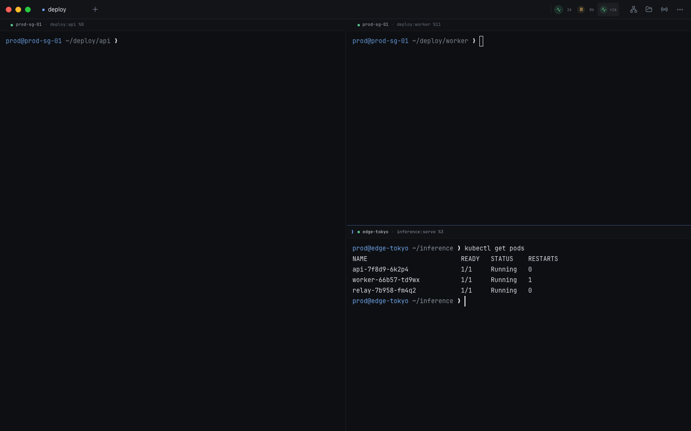
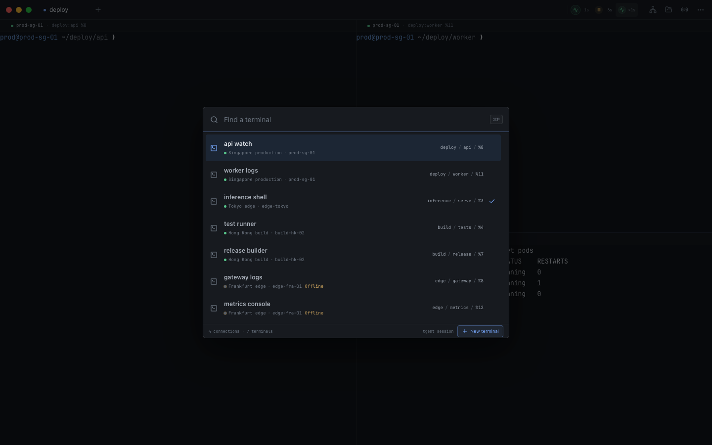
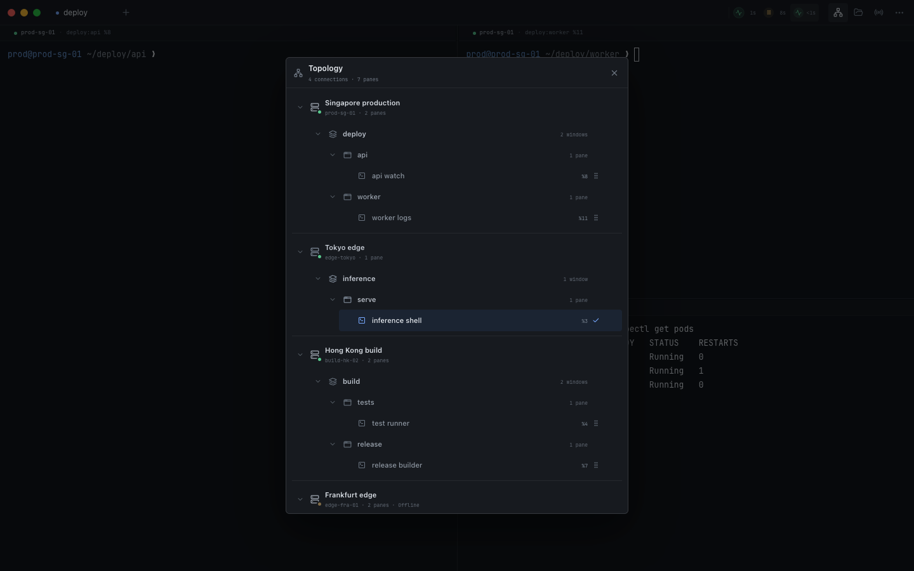
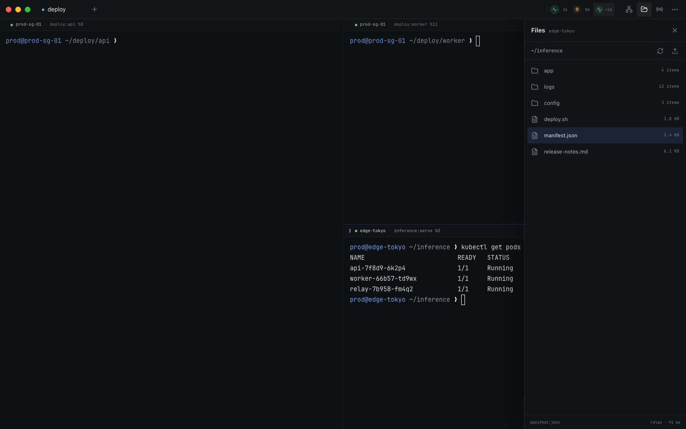
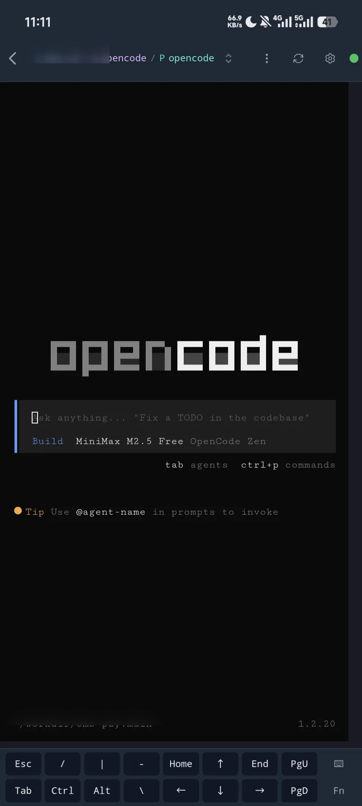
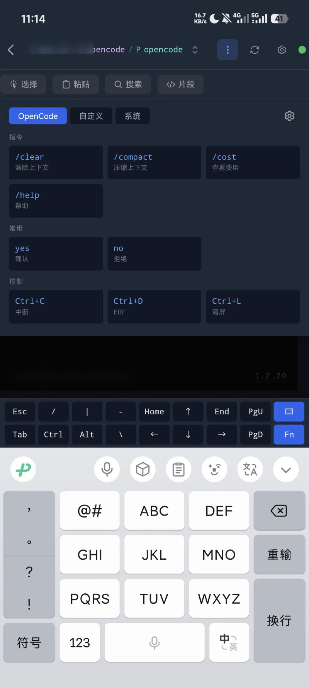
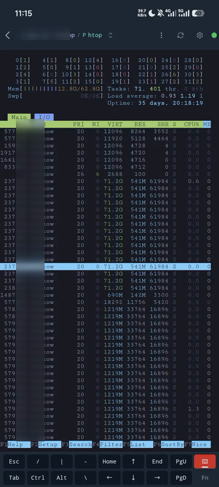

<div align="center">

# TGent

**A terminal workspace built around tmux.**<br>
Keep the process alive. Change the view, machine, or screen whenever you need.

[](https://github.com/lozzo/tgent/actions/workflows/ci.yml)
[](LICENSE)


[Download](https://github.com/lozzo/tgent/releases) · [Quick start](#quick-start) · [Build from source](#build-from-source) · [简体中文](README.zh-CN.md)

</div>



TGent treats tmux as a durable terminal pool and gives it a modern desktop and
mobile workspace. Open the app and continue from the terminal you last used,
arrange terminals into local tabs and splits, or jump to any pane by name. Your
shells and long-running jobs stay in tmux even when a client window closes.

Local use is account-free. The desktop app discovers a running TGent endpoint
and prefers a same-user socket where supported, so a local connection does not
need a password.

> [!IMPORTANT]
> TGent is under active development. tmux is the currently supported terminal
> backend, and release packaging may change before the first stable release.

## Built for terminal-heavy work

- **Terminal Picker** — press `Command/Ctrl + P` and fuzzy-search every terminal
  by title, machine, session, window, or pane. Connection colors make machines
  recognizable at a glance.
- **Local tabs and splits** — arrange views without asking tmux to own the GUI
  layout. Replace a view, split right or below, resize, and keep the underlying
  terminal running.
- **Quake Mode** — summon or hide the desktop from a global shortcut. On macOS,
  the panel follows the pointer to the current display and Space, including
  fullscreen Spaces.
- **Activity watch** — see which terminals are producing output, have gone
  quiet, or need attention. Watch long builds, logs, and coding agents without
  keeping every pane visible.
- **Broadcast input** — choose a set of terminals and send the same input to
  all of them.
- **tmux topology** — browse endpoints, sessions, windows, and panes; create,
  rename, remove, or drag a pane into the current layout with a size preview.
- **Files and image paste** — browse, upload, and download files. Images pasted
  into a remote terminal are uploaded first so terminal programs receive a
  usable remote path.
- **Your terminal, your rules** — configure light and dark themes, terminal
  palettes, transparency, background images, fonts, and shortcuts.

<table>
  <tr>
    <td width="50%">
      
      <br><strong>Find a terminal, not a window.</strong><br>
      Search across machines and the complete tmux identity, then replace the
      current view without disturbing the terminal.
    </td>
    <td width="50%">
      
      <br><strong>See the real tmux tree.</strong><br>
      Work with endpoints, sessions, windows, and panes only when you need the
      full hierarchy.
    </td>
  </tr>
  <tr>
    <td colspan="2">
      
      <br><strong>Terminal and files, in one workspace.</strong><br>
      Browse the active endpoint without navigating away from the terminals.
    </td>
  </tr>
</table>

## A real terminal in your pocket

The Android client is not a reduced session list. It keeps the terminal as the
main surface, adds a touch-friendly control row, and exposes program-aware Fn
actions when a hardware keyboard is not available.

<table>
  <tr>
    <td width="33.33%" align="center">
      
      <br><strong>Keep terminal programs usable.</strong><br>
      Continue shells and coding agents with the terminal filling the screen.
    </td>
    <td width="33.33%" align="center">
      
      <br><strong>Reach the keys software keyboards miss.</strong><br>
      Use control keys, snippets, paste actions, and commands matched to the active program.
    </td>
    <td width="33.33%" align="center">
      
      <br><strong>Full-screen TUIs stay full-screen.</strong><br>
      Monitor processes and operate interactive terminal applications from Android.
    </td>
  </tr>
</table>

## Install

Desktop and Android packages are published on the
[Releases](https://github.com/lozzo/tgent/releases) page as they become
available. Choose the artifact for your platform and architecture. If a package
is not listed yet, use the source build below.

| Platform | Client | Distribution |
| --- | --- | --- |
| macOS | Wails desktop app, including Quake Mode | Release artifact or source build |
| Windows | Wails desktop app | Release artifact or source build |
| Linux | Wails desktop app | Release artifact or source build |
| Android | Capacitor app with native connection and file support | APK or source build |

TGent connects to a TGent endpoint that exposes your tmux sessions. The
endpoint can run on the same computer or another machine.

## Quick start

### 1. Start a local endpoint

Install the separately distributed `tgent` endpoint on a machine with tmux,
then start it locally:

```bash
tgent start --listen 127.0.0.1:8080
```

### 2. Open TGent

Install a desktop release or run the client from source. TGent checks the local
endpoint first and opens your most recent terminal. If tmux has no terminal to
open, create one from Terminal Picker.

Useful endpoint commands:

```bash
tgent status
tgent logs -f
tgent stop
```

## How it works

```text
Desktop / Android
        │
        ├── same-user socket (local)
        └── WebRTC or WebSocket (remote)
                    │
              TGent endpoint
                    │
                   tmux
                    │
        sessions / windows / panes
```

tmux owns terminal lifetime. TGent owns the client experience: tabs, splits,
appearance, shortcuts, activity state, and which view currently controls input
and terminal size. Other views can observe the same pane without resizing it.

## Build from source

### Requirements

- Go 1.24.2 or newer
- Node.js 22 and npm
- tmux 3.0 or newer on the endpoint machine
- Wails CLI 2.12 and its
  [platform dependencies](https://wails.io/docs/v2.12.0/gettingstarted/installation/)
- Android Studio, Android SDK, and NDK 27.2 for Android builds

Clone and verify the client:

```bash
git clone https://github.com/lozzo/tgent.git
cd tgent
make bootstrap
make check
```

Run the desktop client in development:

```bash
go install github.com/wailsapp/wails/v2/cmd/wails@v2.12.0
make dev-desktop
```

Build a desktop application:

```bash
make build-desktop
```

Build an Android debug APK:

```bash
bash client-go/scripts/build-android-client.sh
npm --prefix tgent-app run build
npm --prefix tgent-app run cap:sync
cd tgent-app/android
./gradlew assembleDebug
```

See [Client development](docs/development.md) for generated assets, native
requirements, and release-signing notes.

## Repository layout

| Directory | Purpose |
| --- | --- |
| [`shared`](shared) | React, xterm, state, protocol, and shared client UI |
| [`tgent-desktop`](tgent-desktop) | Wails v2 desktop shell and native OS integrations |
| [`tgent-app`](tgent-app) | Capacitor Android shell and native integrations |
| [`client-go`](client-go) | Go connection engine, WebAssembly, and Android C ABI |

## Contributing

Issues and pull requests are welcome. Start with
[CONTRIBUTING.md](CONTRIBUTING.md), and read [SUPPORT.md](SUPPORT.md) before
opening a usage or integration question.

Do not post pair codes, passwords, tokens, private addresses, file paths, or
terminal contents in a public issue. Report vulnerabilities privately through
the [security policy](SECURITY.md).

## License

TGent client source is available under
[GNU Affero General Public License v3.0 only](LICENSE). Open source does not
mean every TGent product or service is provided without charge. See
[commercial licensing](COMMERCIAL.md) and [trademark policy](TRADEMARKS.md).

Optional TGent hosted connectivity can link endpoints across networks and may
be offered as a paid service.
